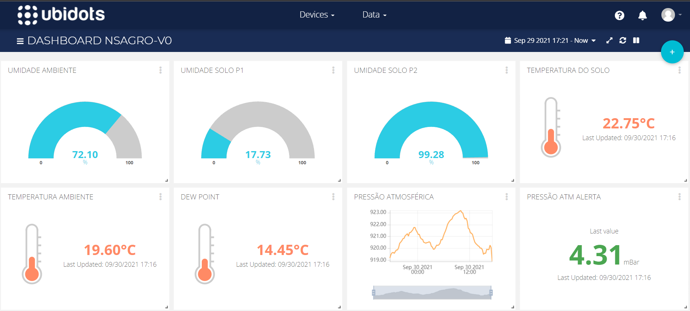
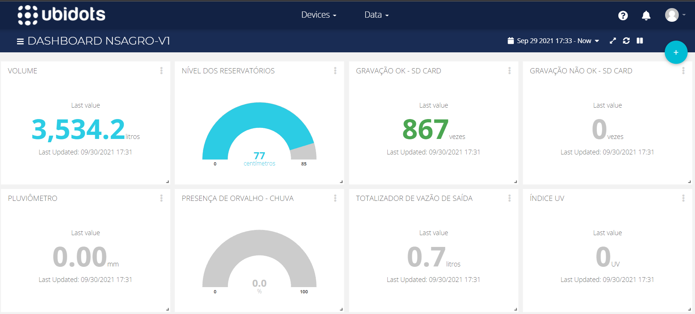
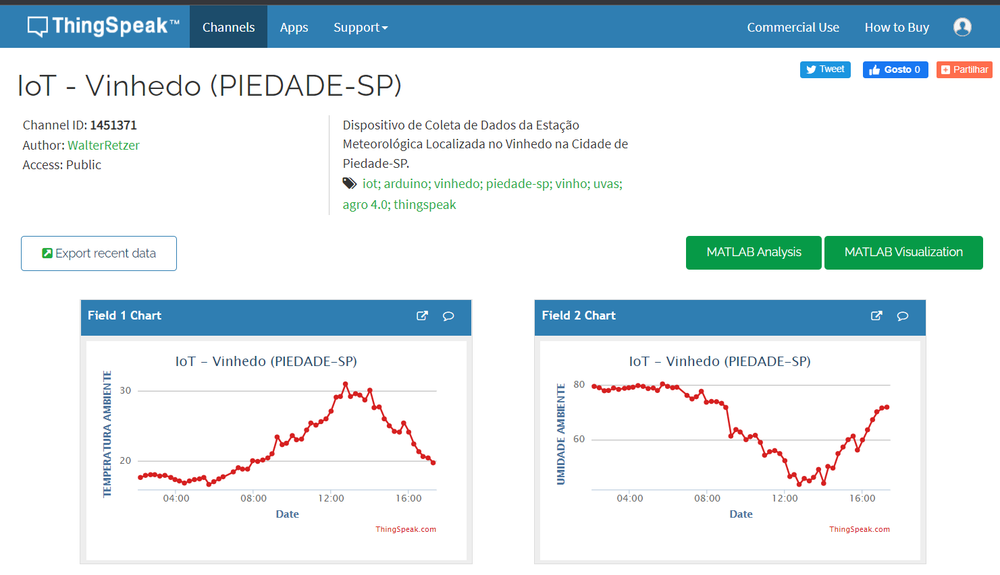
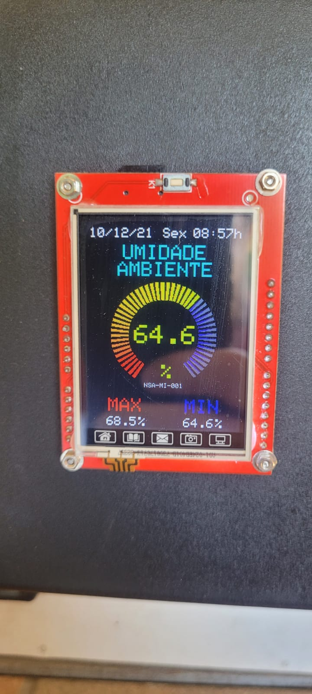

# Projeto_IoT

## - Desenvolvimento do Projeto IoT para monitoramento remoto de variáveis em um vinhedo localizado na cidade de Piedade-SP.

Programa desenvolvido em linguagem C++ para o microcontrolador Arduino Mega com comunicação via GPRS através do módulo SIM800L para envio de dados aos servidores das plataformas ThingSpeak e Ubidots.

## - Objetivo

Otimizar os recursos hídricos, de forma a evitar desperdícios na irrigação e possibilitar um acompanhamento dinâmico das condições climáticas de forma mais precisa. 

Permitir tornar mais assertiva a tomada de decisão em relação ao momento correto da pulverização para controle de fungos e pragas. 

Com o auxílio do monitoramento contínuo de determinadas variáveis, como por exemplo: temperatura, umidade e precipitação, proporcionar um melhor controle de aplicação de insumos num Vinhedo localizado na cidade de Piedade-SP.

### Link para acompanhamento "online" do valor das variáveis enviadas ao Server Ubidots:

[Device NSAGRO-V0](https://stem.ubidots.com/app/dashboards/public/dashboard/RM46zAAWtc7iVD0QDzJpVMZH8U6MNa2qeC3lKmuj2_c?displayTitle=true&embed=true%22%3E%3C/iframe%3E)

[Device NSAGRO-V1](https://stem.ubidots.com/app/dashboards/public/dashboard/r6Hq_Z0B86hJZDFtLyvHuj6fIT5ylKLKyef7xHg364U?displayTitle=true&embed=true%22%3E%3C/iframe%3E)

### Link para acompanhamento "online" do valor das variáveis enviadas ao Server ThingSpeak, Channel ID: 1451371, Canal Público IoT - Vinhedo (PIEDADE-SP):
[Channel ID: 1451371](https://thingspeak.com/channels/1451371)

### Link do vídeo do YouTube referente ao funcionamento de leitura dos sensores do Protótipo Nano Smart Agro:

[Youtube: Projeto IoT - Nano Smart Agro exibindo os valores dos sensores](https://www.youtube.com/watch?v=MGhgLQITPXU)

### Link do vídeo do YouTube referente ao envio dos dados aos Servers Ubidots e ThingSpeak do Protótipo Nano Smart Agro:

[YouTube: Projeto IoT - Nano Smart Agro enviando dados ao Ubidots e ThingSpeak.](https://www.youtube.com/watch?v=kZP03ruk-PY)

### Dashboard do Server Ubidots com os valores dos sensores do Device NSAGRO-V0:

### Dashboard do Server Ubidots com os valores dos sensores do Device NSAGRO-V1:

### Dashboard do Server ThingSpeak com os valores dos sensores do Canal ID: 1451371

Os dados de Temperatura, Umidade, Luminosidade, Indice Ultravioleta, Pressão Atmosférica, Nível, Volume, Pluviômetro e Vazão são enviados a cada 15minutos aos Servers Ubidots e ThingSpeak.

São utilizados no protótipo IoT os seguintes módulos/sensores: 
 - Módulo SIM800L;
 - Módulo DS3231;
 - BMP 280; 
 - BH1750;
 - Display Touch Screen TFT 2.4";
 - Sensor Distância Ultrassônico JSN-SR04T;
 - Sensor DHT22;
 - Pluviometro Tipo Bascula;
 - Módulo Sensor de Chuva;
 - Sensor Capacitivo De Umidade Do Solo V1.2;
 - Módulo Termopar MAX6675;
 - Sensor Uv Ultravioleta GUVA-S12SD;
 - Sensor De Fluxo 2 Polegadas
 
 
## - O que é IoT?

A Internet das Coisas (em inglês: *Internet of Things*, IoT) descreve a rede de “objetos físicos” incorporados a sensores, software e outras tecnologias com o objetivo de conectar e trocar dados com outros dispositivos e sistemas pela internet. 

Esses dispositivos variam de objetos domésticos comuns a ferramentas industriais sofisticadas. Com mais de 7 bilhões de dispositivos IoT conectados hoje, os especialistas esperam que esse número cresça para 10 bilhões em 2020 e 22 bilhões em 2025.

<https://www.oracle.com/br/internet-of-things/what-is-iot/>

## - Motivação para o desenvolvimento do Projeto IoT empregado na Agricultura

O último censo agropecuário do Instituto Brasileiro de Geografia e Estatística (IBGE) mostrou que 1,5 milhão de produtores rurais acessam dados por meio de dispositivos eletrônicos, número 1.900% superior ao de 10 anos atrás.

<https://revistapesquisa.fapesp.br/agricultura-4-0/>

Mas um estudo da Escola Superior de Agricultura Luiz de Queiroz da Universidade de São Paulo (Esalq-USP) indica que apenas 5% da área agriculturável do país está conectada à internet.

Por isso, uma possível solução, seria acelerar a adoção de IoT e de outras tecnologias nos negócios de pequenos agricultores, facilitando assim o acesso a meios digitais a todos.  

<https://abrasat.org.br/2020/11/03/agricultura-conectada-uma-industria-movida-a-dados/>

## - E como a Agricultura pode se beneficiar com a IoT?

São várias as aplicações no campo. É possível tomar decisões mais assertivas no uso de fungicidas, acompanhar as condições climáticas de forma mais precisa e ainda controlar o uso de água nas propriedades. São facilidades que ajudarão, certamente, o produtor a se tornar mais competitivo.

A comunicação pode ser facilitada por meio de sensores, que utilizam o rádio digital como via de transmissão de voz e de dados, aumentando, assim, a segurança e impulsionando a produtividade e o lucro. Essa linha direta ajudará e muito na agilidade de recebimento de informações, auxiliando em tomadas de decisões mais rápidas e eficientes.

O controle de pragas também pode se tornar muito mais eficiente com sensores Iot instalados nas lavouras. Eles transmitem informações em tempo real sobre a saúde das plantações, capturando imagens não visíveis a olho nu. Além, também, de coletar dados sobre padrões de comportamento das pragas. Dessa forma, é possível encontrar meios de combatê-las muito mais rapidamente, evitando perdas na colheita.

Sensores também possibilitam observar a quantidade exata de água a ser utilizada nas lavouras, o que ajuda, e muito, no processo produtivo e a evitar perdas pelo uso excessivo ou pela falta de irrigação.

A aplicação de todas essas tecnologias, para ser realmente benéfica ao processo produtivo, precisa vir acompanhada de uma boa gestão por quem trabalha na lavoura. Por isso, é necessário que os produtores pensem na educação digital de todos que fazem parte do seu time de funcionários. Dessa forma, a balança estará equalizada e as lavouras irão ser totalmente transformadas, trazendo como metas uma maior produtividade e mais rentabilidade.

<https://digitalagro.com.br/2020/06/01/iot-na-agricultura-mais-precisao-e-controle-das-lavouras/>

## - Telas do Display do Protótipo

